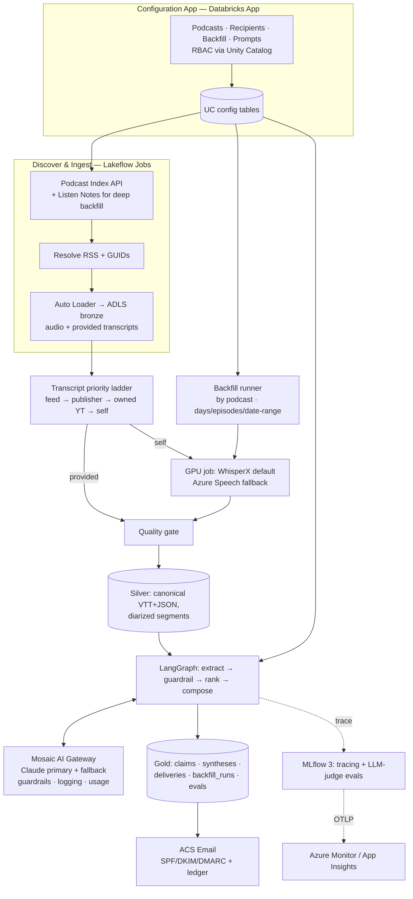

# Architecture & Build Options — Evaluation and Recommendations

**Companion to** [`product-specification.md`](product-specification.md)
**Purpose:** lay out the real design choices at each layer, weigh them (pros/cons), and give a **clear recommendation** and an **overall recommended architecture**.
**Audience:** Technology Global Equity desk + platform/engineering reviewers.
**Date:** 2026-08-17 · **Status:** Draft v1.0 for decision

---

## 0. How to read this document

The platform is a pipeline: **discover → ingest → transcribe → extract → personalise → deliver**, wrapped in **orchestration + governance**. Each section below is one decision, structured as:

- **The options** (a comparison table)
- **Pros / cons** of each
- **✅ Recommendation** and *why*

Section 10 assembles the picks into **one recommended architecture** and a phased build path. Where a choice is genuinely close, it is flagged as **config-selectable** so we are not locked in.

**Guiding principles used to score every option**
1. **Reliability over cleverness** — the daily email must never silently fail.
2. **Data stays in-tenancy** — buy-side compliance; prefer Azure/Databricks-resident processing.
3. **Config-driven, not code-driven** — add a show or a recipient without a deploy.
4. **Portable pilot** — Stream A must graduate into Stream B without a rewrite (shared data model + `config/`).
5. **Measured quality** — nothing ships without groundedness/relevance evals.

---

## 1. Overall build approach — the meta-decision

### Options

| Option | Description |
|---|---|
| **A. Quick only** | Claude Code + Cowork + scripts; run it indefinitely |
| **B. Production only** | Go straight to Azure Databricks platform |
| **C. Two-stream (A then B)** ✅ | Ship the quick pilot now; build the platform in parallel; retire A into B at parity |

### Pros / cons

**A. Quick only**
- ➕ Live in days; near-zero infra; easy to change.
- ➖ No RBAC/audit/eval gates; hard to scale to 45 recipients + 50 shows; not a system of record; key-person/tooling risk.

**B. Production only**
- ➕ Governed, scalable, auditable from day one.
- ➖ 6–10 weeks before the first email; you design recipient preferences and content quality **in the dark**, risking building the wrong thing well.

**C. Two-stream** ✅
- ➕ Learn recipient angles and content quality **cheaply and fast** in A, then build B against validated requirements; parallelisable; A is a fallback if B slips.
- ➖ Two things running briefly; requires discipline to keep `config/` and the data model shared so A→B is a lift, not a rewrite.

### ✅ Recommendation
**Option C — two-stream.** The expensive, uncertain part of this project is **not** the plumbing; it is *what makes a synthesis useful to a specific analyst*. Stream A buys that knowledge in days at trivial cost, and — because both streams share the medallion data model and the `config/*.yaml` format — the pilot's learnings and config drop straight into the platform. Treat A as the **requirements-discovery and fallback lane**, B as the **system of record**.

---

## 2. Ingestion & discovery — how we get episodes

### Options

| Option | How | In-tenancy? |
|---|---|---|
| **RSS-first via Podcast Index** ✅ | Resolve canonical feed from the open index, parse items, pull audio + any `podcast:transcript` | Yes |
| Per-app integrations (Apple/Spotify APIs) | Integrate each listening app | No stable content API |
| Paid aggregator (Listen Notes / Taddy) | Use a paid search/metadata API as primary | Partly (their API) |

### Pros / cons

**RSS-first + Podcast Index** ✅
- ➕ One code path covers **every** show; open and free; gives GUIDs (dedupe), enclosure URLs (audio), and transcript-tag links; no vendor lock.
- ➖ Feeds are often **truncated** to recent episodes → deep backfill needs a supplementary source.

**Per-app APIs**
- ➕ "Native" feel.
- ➖ **No reliable public content API** on Apple/Spotify; you'd be scraping/ToS-risky and rebuilding per app. Reject.

**Paid aggregator as primary**
- ➕ Broader historical episode listings (helps backfill depth); richer metadata.
- ➖ Cost; dependency; still ultimately points at the RSS/audio.

### ✅ Recommendation
**RSS-first via Podcast Index as the backbone**, with **Listen Notes (paid) as an optional backfill-depth helper** only when a feed is truncated below a requested backfill window. This keeps ingestion uniform and in-tenancy, and confines paid dependency to the one thing RSS is bad at (deep history).

---

## 3. Transcript sourcing — buy vs. make, per episode

### Options
1. **Use provided transcript** (`podcast:transcript` feed tag / publisher site).
2. **Owned/licensed YouTube captions.**
3. **Self-transcribe** every episode regardless.
4. **Priority ladder** (try 1 → 2 → 3, gated on quality). ✅

### Pros / cons

- **Provided transcript:** ➕ free, licit, often speaker-labelled. ➖ inconsistent coverage; variable quality (tickers/jargon errors); **not** available via Apple/Spotify APIs — only if the *feed itself* carries the tag.
- **YouTube captions:** ➕ many tech shows have video versions. ➖ programmatic download needs channel ownership; auto-caption scraping is a ToS/licensing grey area → **owned/licensed channels only**.
- **Always self-transcribe:** ➕ uniform quality, full control, diarization + word timestamps. ➖ wastes compute when a good transcript already exists.
- **Priority ladder (gated):** ➕ cheapest licit source first, guaranteed fallback, **100% coverage**; a quality gate re-transcribes anything garbled. ➖ slightly more logic (worth it).

### ✅ Recommendation
**Priority ladder with a quality gate:** feed tag → publisher site → owned YouTube → **WhisperX self-transcribe**, accepting the first source that passes a language+coverage+ASR-sanity check. This is the single most important reliability decision: it guarantees every enabled episode ends up with a **normalised, cited-quotable transcript**, no matter the provider.

---

## 4. Transcription engine — the "up to 90 minutes, reliably" decision

### Options

| Engine | Type | 90-min | Diarization | Marginal cost | Data residency |
|---|---|---|---|---|---|
| **WhisperX** ✅ default | Self-hosted OSS | ✅ VAD-chunked | ✅ pyannote | GPU compute only (~cents) | In-tenancy |
| faster-whisper | Self-hosted OSS | ✅ | ➕ add pyannote | GPU compute | In-tenancy |
| NVIDIA NeMo / Parakeet | Self-hosted OSS | ✅ very fast | ✅ | GPU compute | In-tenancy |
| **Azure AI Speech** ✅ fallback | Managed (Azure) | ✅ batch | ✅ | ~$1/hr | **In Azure** |
| Deepgram Nova-3 | Managed API | ✅ | ✅ | low ($/min) | External |
| AssemblyAI Universal | Managed API | ✅ | ✅ + intelligence | ~$0.15/hr | External |
| OpenAI gpt-4o-transcribe | Managed API | ✅ | ✗ | ~$0.36/hr | External |
| Speechmatics | Managed API | ✅ | ✅ | usage | External |

### Pros / cons (the ones that matter)

**WhisperX (self-hosted)** ✅
- ➕ Word-level timestamps **and** speaker labels — exactly what cited, per-speaker synthesis needs; near-zero marginal cost at scale; data never leaves the tenancy; batch-friendly on a Databricks GPU job (~2–6 min per 90-min episode).
- ➖ You own the GPU cluster and pyannote model/licence setup; cold-start and ops overhead; occasional hard audio needs a stronger model.

**Azure AI Speech (managed, in-Azure)** ✅ fallback
- ➕ Enterprise SLA, diarization, **stays inside Azure** (residency/VNet); zero GPU ops.
- ➖ Per-hour cost; slightly less control over word-alignment niceties.

**Deepgram / AssemblyAI / OpenAI / Speechmatics**
- ➕ Simple, fast, sometimes best-in-class accuracy (Speechmatics) or bundled intelligence (AssemblyAI).
- ➖ **Data leaves the tenancy** — a compliance friction for a buy-side desk; per-minute cost adds up over backfill.

### ✅ Recommendation
**WhisperX self-hosted as the default** (cost, control, diarization, residency), **Azure AI Speech as the automatic fallback** when the quality gate fails or for SLA-critical runs. Make the engine **config-selectable per show** (`transcription_engine` in `podcasts.yaml`) so a problem show can be pinned to a paid engine with no code change. Keep **AssemblyAI** on the bench as an option if you later want to offload some extraction (entities/PII/summaries) to the STT layer. Avoid making an external per-minute API the *default* — backfilling hundreds of 90-minute episodes through it is where costs and residency concerns spike.

---

## 5. Synthesis LLM & access path

### Options

| Option | Description |
|---|---|
| **Claude via Mosaic AI Gateway** ✅ (Stream B) | All model calls through one governed Databricks endpoint |
| Claude via Claude Code / Cowork (Stream A) | Direct use for the pilot |
| Direct Claude API from app code | No gateway |
| Databricks-hosted foundation model | Open-weights model on Databricks serving |

### Pros / cons

- **Claude via AI Gateway** ✅: ➕ one front door with guardrails (PII), rate limits, **payload logging to inference tables**, usage/cost in system tables, and **fallbacks/traffic-split**; provider-agnostic so a secondary model is a config change. ➖ Databricks-coupled (fine — that's the platform).
- **Claude via Claude Code/Cowork**: ➕ perfect for the pilot — fast, no infra, strong reasoning for extraction + composition. ➖ not governed/audited enough for the system of record.
- **Direct API, no gateway**: ➕ simplest. ➖ you re-implement logging, guardrails, rate limits, cost tracking — reject for production.
- **Databricks-hosted open model**: ➕ fully in-tenancy, cheap at scale. ➖ synthesis quality/instruction-following for nuanced, cited, compliance-sensitive financial summaries is the crux — validate before relying on it; good as a *fallback* tier, not the primary.

### ✅ Recommendation
**Claude as the primary synthesis model, fronted by Mosaic AI Gateway in Stream B** (and used directly via Claude Code/Cowork in Stream A). Configure the Gateway with guardrails, per-user rate limits and payload logging, and register a **secondary/fallback model** for resilience. Keep transcription models (Whisper-family/NeMo) separate — Claude is for reasoning/synthesis, not ASR.

---

## 6. Synthesis strategy — how to serve 45 recipients efficiently

### Options

| Option | Cost/latency | Quality |
|---|---|---|
| **Per-recipient full-transcript pass** | 45× LLM passes over full transcripts — expensive/slow | High but wasteful |
| **One global summary, same to everyone** | Cheapest | Ignores individual angles — fails the brief |
| **Extract-once → rank → compose-per-recipient** ✅ | One extraction/episode + small compose/recipient over *selected claims* | Tailored **and** efficient |

### Pros / cons

- **Per-recipient full pass:** ➕ maximally bespoke. ➖ 45× token cost per episode, slow, redundant — the same transcript re-read 45 times.
- **One global summary:** ➕ trivial. ➖ not tailored → defeats the purpose.
- **Extract-once → rank → compose** ✅: ➕ the expensive read happens **once**; personalisation is cheap ranking + a short grounded compose over only the claims that matter to each analyst; naturally cited and eval-able; scales past 45. ➖ needs a claim schema and an angle taxonomy (already defined in `config/recipients.yaml`).

### ✅ Recommendation
**Extract-once → match/rank → compose-per-recipient.** It is the only option that is *both* genuinely tailored *and* affordable at 45 recipients, and it makes groundedness trivial to enforce (compose is constrained to pre-extracted, cited claims). This is the backbone of §7 in the spec.

---

## 7. Orchestration & compute (Stream B)

### Options

| Option | Fit |
|---|---|
| **Databricks Workflows / Lakeflow Jobs + DLT** ✅ | Native to the chosen platform; medallion pipelines; GPU job clusters for STT |
| Azure Data Factory + Functions | Azure-native but splits compute away from the lakehouse |
| Airflow (self-managed) | Powerful, but another system to run |
| Serverless functions only | Simple for small scale; awkward for GPU batch + lakehouse |

### Pros / cons

- **Databricks Workflows/Lakeflow** ✅: ➕ one platform for ingestion, GPU transcription, Spark transforms, LLM chains, Unity Catalog governance, and scheduling; Asset Bundles for CI/CD. ➖ Databricks-centric (intended).
- **ADF + Functions:** ➕ familiar Azure orchestration. ➖ data/compute sprawl across services; weaker lineage/governance story than Unity Catalog.
- **Airflow:** ➕ flexible DAGs. ➖ operational burden, duplicate scheduler.
- **Serverless-only:** ➖ poor fit for 90-min GPU batch + lakehouse tables.

### ✅ Recommendation
**Databricks Workflows / Lakeflow with DLT pipelines** for bronze→silver→gold and a **GPU job cluster** for WhisperX. Keep everything — ingest, transcribe, extract, compose, evals — inside the lakehouse so lineage, governance and cost tracking are unified. Use **Databricks Asset Bundles + Git** for promotion dev→staging→prod.

---

## 8. LLM chain framework

### Options

| Option | Fit |
|---|---|
| **LangGraph (+ LangChain components), MLflow-traced** ✅ | Stateful multi-step graph: extract → guardrail → rank → compose, with retries/branches |
| Plain LangChain (LCEL) | Fine for linear chains |
| Direct SDK calls, hand-rolled | Max control, more glue code |
| Semantic Kernel | Azure-friendly alt |

### Pros / cons

- **LangGraph** ✅: ➕ models the pipeline as a graph with explicit state, conditional branches (e.g. quality-gate re-transcribe, guardrail-block → human review) and retries; integrates with MLflow autolog/tracing. ➖ a dependency to learn.
- **Plain LangChain:** ➕ simplest for linear flows. ➖ awkward once you add branching/human-in-the-loop.
- **Direct SDK:** ➕ no framework risk. ➖ you rebuild tracing/retry/state plumbing.
- **Semantic Kernel:** ➕ nice .NET/Azure story. ➖ smaller ecosystem for this Python/Databricks stack.

### ✅ Recommendation
**LangGraph for the orchestration graph, LangChain components where convenient, all wrapped in MLflow tracing**, with **all model traffic through the AI Gateway**. The branching (quality gate, guardrail block → review, fallback model) is exactly what LangGraph is for; MLflow tracing gives OpenTelemetry-native spans for free.

---

## 9. Configuration surface, email, and observability (short-form decisions)

### 9.1 Configuration app
| Option | Verdict |
|---|---|
| **YAML in Git (Stream A) → Databricks App / Streamlit over Unity Catalog tables (Stream B)** ✅ | Start with reviewable, versioned YAML; graduate to a UI backed by config tables with RBAC (analysts edit only their own recipient row; admins manage shows & backfill). |
| Config-in-code | ➖ requires a deploy per change — reject. |
| Full custom web app (Azure App Service + DB) | ➕ most flexible; ➖ more to build/host than a Databricks App. Keep as an option if the UI grows. |

**✅ Recommendation:** YAML-first, then a **Databricks App / Streamlit** over Unity Catalog config tables. The backfill screen (podcast picker + days/episodes/date-range + **cost estimate** + run) lives here.

### 9.2 Email delivery
| Option | Verdict |
|---|---|
| **Azure Communication Services — Email** ✅ | In-Azure, SPF/DKIM/DMARC, delivery ledger; residency-friendly. |
| SendGrid / other ESP | ➕ mature deliverability; ➖ external. Good pilot choice / alternative. |
| Microsoft Graph / Exchange | Use if sends must originate from a corporate mailbox. |
| Cowork Gmail connector | Pilot cohort only (Stream A). |

**✅ Recommendation:** **ACS Email** for production (in-tenancy), SendGrid or the **Gmail connector** acceptable for the Stream A pilot.

### 9.3 Observability / evals
| Layer | Choice |
|---|---|
| Governed model access | **Mosaic AI Gateway** — guardrails, rate limits, payload logging (inference tables), usage system tables, fallbacks ✅ |
| Tracing | **MLflow 3 tracing** (OpenTelemetry-native, GenAI semantic conventions) → also **OTLP export to Azure Monitor / App Insights** ✅ |
| Evals | **MLflow LLM-judge scorers** on a golden set, recorded per experiment, **gating CI promotion**; same judges reused in production monitoring ✅ |
| Human feedback | Thumbs up/down in the email/app → back into the eval set |

**✅ Recommendation:** Gateway + MLflow 3 is the "gold-standard interface where logging, guardrails, evals and OpenTelemetry can be run and recorded." Do **not** hand-roll observability.

---

## 10. Recommended overall architecture

Putting the picks together:

### Summary of recommendations
| Decision | Recommendation |
|---|---|
| Build approach | **Two-stream** (quick pilot → productionise) |
| Ingestion | **RSS-first via Podcast Index** (+ Listen Notes for deep backfill) |
| Transcript sourcing | **Priority ladder with quality gate** (100% coverage) |
| Transcription engine | **WhisperX default, Azure AI Speech fallback**, per-show selectable |
| Synthesis model | **Claude via Mosaic AI Gateway** (secondary model configured) |
| Synthesis strategy | **Extract-once → rank → compose-per-recipient** |
| Orchestration | **Databricks Workflows / Lakeflow + DLT + GPU job** |
| Chain framework | **LangGraph + LangChain, MLflow-traced** |
| Config surface | **YAML → Databricks App over Unity Catalog** |
| Email | **Azure Communication Services Email** (SendGrid/Gmail for pilot) |
| Observability/evals | **Mosaic AI Gateway + MLflow 3 (OTel) + LLM-judge CI gates** |

### Phased build path
1. **Weeks 1–2 — Stream A pilot:** RSS-first ingest, WhisperX transcription, Claude extract+compose, 5 shows / 3–5 analysts, email via Gmail/SendGrid, manual eval. *Goal: validate content quality and recipient angles.*
2. **Weeks 3–5 — Foundations:** Databricks workspace, Unity Catalog schemas, ingestion job, GPU WhisperX job, silver transcripts, Gateway endpoint.
3. **Weeks 5–7 — Synthesis & delivery:** LangGraph graph, recipient profiles, ACS email, first 10 recipients, MLflow tracing.
4. **Weeks 7–9 — Governance & evals:** guardrails, golden-set evals + CI gates, OTel→Azure Monitor, backfill runner, cost dashboards.
5. **Weeks 9–12 — Config App & scale-out:** Databricks App, RBAC, roll out to 45, self-serve preferences.

### Key trade-offs to accept, explicitly
- **Self-hosted STT ops burden** in exchange for cost, control, diarization and residency — mitigated by the Azure Speech fallback.
- **Databricks-centric coupling** in exchange for unified governance, lineage and cost tracking — mitigated by OpenTelemetry-native tracing and RSS-first, config-driven design (no lock-in on the parts that matter).
- **Two streams briefly in flight** in exchange for fast learning and a fallback — mitigated by a shared data model and `config/` format.

---

## Appendix — decision log (one-liners)
- **Reject** per-app (Apple/Spotify) content integrations — no stable public API.
- **Reject** always-self-transcribe — wasteful when a good feed transcript exists (but keep it as the guaranteed fallback).
- **Reject** per-recipient full-transcript passes — 45× cost for no quality gain over extract-once.
- **Reject** hand-rolled observability — Gateway + MLflow already provide logging, guardrails, evals and OTel.
- **Defer** Databricks-hosted open-weights model to a *fallback* tier until synthesis-quality evals justify promotion.
