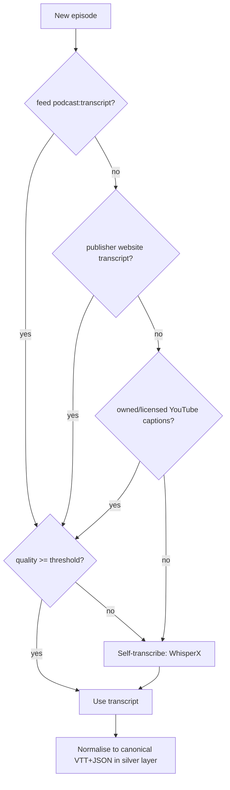
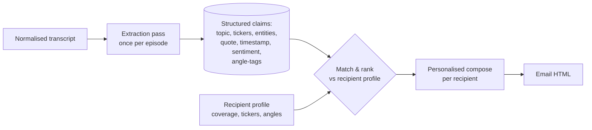
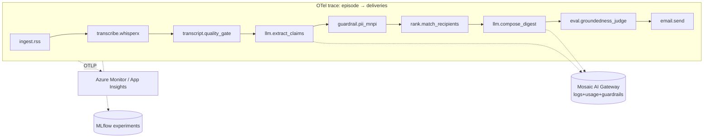
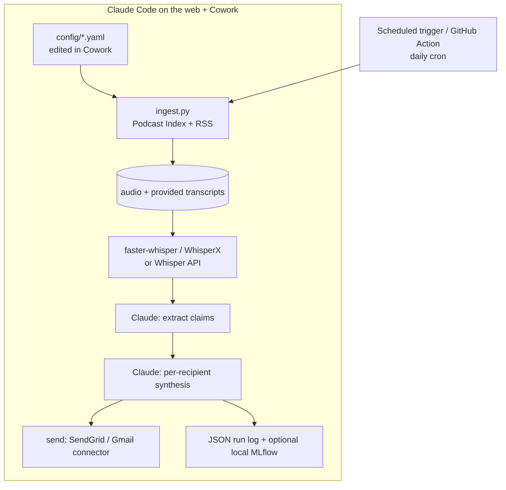
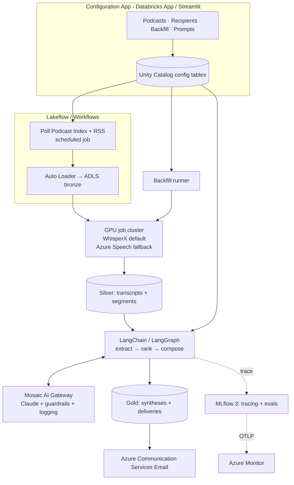

# Podcast Synthesis Platform — Product Specification

**Owner:** Technology Global Equity desk
**Prepared for:** Investment team (up to 45 analysts & portfolio managers)
**Status:** Draft v1.0 — for review
**Date:** 2026-08-17

---

## 1. Executive summary

We want a **reliable, production-ready email synthesis of technology & AI podcasts**, tailored per recipient, with podcasts that can be **dynamically added** and **backfilled** on demand. Many shows lack a usable transcript, so the platform must **transcribe reliably first**, then extract, personalise and deliver.

This document specifies **two streams of work** that share one data model and config format so the first can graduate into the second:

| | **Stream A — Quick** | **Stream B — Productionised** |
|---|---|---|
| Built with | Claude Code + Cowork, small Python scripts | Azure Databricks (Lakehouse), Mosaic AI Gateway, MLflow 3, LangChain/LangGraph, Config App |
| Time to first email | Days | 6–10 weeks to MVP |
| Scale | 5–15 shows, ~10 recipients | 50+ shows, 45 recipients, full backfill |
| Governance / evals | Lightweight, manual | Guardrails, LLM-judge evals, OpenTelemetry, audit, RBAC |
| Purpose | Prove value fast, pilot with a few analysts | The reliable, governed system of record |

The two streams are **not competing designs** — Stream A is the pilot that de-risks content quality and recipient preferences; Stream B is the governed platform. Config (`config/podcasts.yaml`, `config/recipients.yaml`) is portable between them by design.

---

## 2. Goals, non-goals, requirements

### 2.1 In scope
- Ingest any podcast by RSS; **add shows dynamically** (config-only, no redeploy).
- **Backfill** history, selectable **by podcast** and **by number of days _or_ episodes _or_ date range**.
- **Transcribe reliably** where no transcript exists, up to **90-minute** episodes (and longer).
- Extract structured, cited claims (topics, tickers, entities, quotes, sentiment).
- **Per-recipient synthesis** for up to 45 analysts/PMs based on their coverage, angles and preferences.
- **Email delivery**, production-grade (deliverability, audit, unsubscribe/preferences).
- Observability: **logging, guardrails, evals, OpenTelemetry**, recorded runs.

### 2.2 Out of scope (v1)
- Real-time / live transcription. Podcasts are batch by nature.
- Trading signals or automated investment recommendations (explicitly guardrailed **out** — see §11).
- Non-English shows in v1 (design leaves room; WhisperX/Azure both support multilingual later).

### 2.3 Key non-functional requirements
- **Reliability:** every enabled episode is either synthesised or flagged with a reason. No silent drops.
- **Compliance:** buy-side controls — MNPI handling, no investment advice, PII redaction, full audit lineage.
- **Cost transparency:** per-episode and per-recipient cost tracked (transcription + LLM tokens).
- **Idempotency:** re-running ingest/backfill never duplicates or double-sends.

---

## 3. Podcast providers — the full landscape

A crucial design fact: **podcasts are an open RSS ecosystem.** The "provider" you subscribe in (Apple, Spotify, …) is a *rendering surface*; the durable, ingestible source is the show's **RSS feed**. We therefore ingest from RSS and use directories only to *discover* the feed URL.

Providers fall into four categories:

### 3.1 Directories / listening apps (consumption surfaces)
Apple Podcasts · Spotify · YouTube & YouTube Music (now the home of the former Google Podcasts audience) · Amazon Music / Audible · Pocket Casts · Overcast · Castbox · iHeartRadio · Podcast Addict · Player FM · Deezer · Podurama.

> These render feeds; most do **not** expose episode content via a stable public API. Do **not** build ingestion on top of any single app.

### 3.2 Open indexes & discovery APIs (how we find the feed)
| Source | Access | Use |
|---|---|---|
| **Podcast Index** | Free, open API | **Primary discovery** — search show → get canonical RSS URL, episode GUIDs, `podcast:transcript` links |
| Apple/iTunes Search API | Free | Secondary lookup by name → maps to feed |
| **Listen Notes API** | Paid | Rich search/metadata, good backfill breadth |
| Podchaser / Taddy API | Paid/freemium | Metadata, credits, categories |

### 3.3 Hosting platforms (where feeds originate — and sometimes carry transcripts)
Megaphone · Acast · Libsyn · Buzzsprout · Transistor · Simplecast · Art19 · Spreaker · RedCircle · Captivate · Substack (audio). Some emit the `podcast:transcript` tag automatically; this is where the *best-case* transcript comes from.

### 3.4 What this means for the design
Ingestion is **RSS-first**: resolve feed via Podcast Index → parse items → per item, look for a transcript, else transcribe. One code path covers every "provider."

---

## 4. Transcripts — who has them, and the reality

**Short answer: coverage is partial and inconsistent, so the platform must be able to transcribe everything itself.**

### 4.1 The machine-readable path: `podcast:transcript` (Podcasting 2.0)
The [Podcast Namespace](https://podcastnamespace.org/tag/transcript) defines a `<podcast:transcript>` element inside each RSS `<item>`, linking a transcript file (VTT, SRT, JSON, HTML, or plain text). This is the **gold path** — licit, free, often speaker-labelled and time-aligned.

Adoption in 2026:
- Apple Podcasts began **displaying** transcripts in-app in 2024; Spotify added **Podcasting 2.0 transcript** support in **late 2025**. Three of the five biggest clients now render a feed-linked transcript. ([Podnews](https://podnews.net/update/spotify-transcripts-p20), [Apple](https://podcasters.apple.com/support/5316-transcripts-on-apple-podcasts))
- **VTT** is the universally-readable format; SRT works on most clients; JSON is richest (Spotify).

### 4.2 The catch (why we still need our own transcription)
- **Apple and Spotify auto-generate transcripts for in-app display but do NOT expose them via a public API.** You cannot reliably pull "Apple's transcript" programmatically.
- Feed transcript tags are present for **some** shows, absent for many — especially independent tech/AI shows and older back-catalogue episodes.
- Auto-generated transcripts vary in quality (errors on tickers/jargon, sometimes no speaker labels).
- **YouTube captions** exist for many tech shows' video versions, but programmatic use is constrained: the official Data API `captions.download` requires channel ownership; scraping auto-captions is a ToS/licensing grey area. Treat YouTube as *opportunistic*, only for owned/licensed channels.

### 4.3 Transcript acquisition strategy (per episode)
Resolve in priority order, stopping at the first that meets the quality bar:



Quality gate = language match, coverage (duration vs. transcript span), and a spot LLM check for garbled ASR. Below threshold → we re-transcribe ourselves. **Result: 100% of enabled episodes end up with a normalised transcript**, regardless of provider.

---

## 5. Transcription options

Target: **reliable transcription of up to 90-minute** (and longer) episodes, with **speaker diarization** (podcasts are multi-speaker) and word-level timestamps for citations.

### 5.1 Free / open-source (self-hosted — compute cost only)

| Tool | What it is | 90-min handling | Diarization | Notes |
|---|---|---|---|---|
| **WhisperX** ⭐ | faster-whisper + wav2vec2 alignment + `pyannote` diarization | ✅ VAD-chunked, batched | ✅ built-in (pyannote) | **Recommended default.** Word-level timestamps + speaker labels — ideal for cited, per-speaker podcast synthesis |
| **faster-whisper** | Whisper on CTranslate2 | ✅ ~4× faster, low memory | ➕ add pyannote | Great when you don't need alignment niceties |
| OpenAI Whisper (orig.) | Reference PyTorch impl. | ✅ but slower/heavier | ✗ (add pyannote) | Baseline accuracy reference |
| whisper.cpp | C/C++ port | ✅ CPU/edge | ✗ | Cheapest CPU option; slower |
| distil-whisper | Distilled, English | ✅ very fast | ✗ | Speed play for EN-only |
| NVIDIA NeMo (Parakeet / Canary) | NVIDIA STT | ✅ very fast/accurate | ✅ | Strong on GPU; good Databricks fit |

A 90-minute episode transcribes in **~2–6 minutes on a single modern GPU** (e.g. A10/L4/A100) with WhisperX. On Databricks this is a **GPU job cluster** running a batch notebook/wheel — "free" meaning no per-minute vendor fee, only cluster compute.

**Model source (Claude API note):** transcription models above are OpenAI-Whisper-derived / NVIDIA, not Anthropic. Claude is used for the *synthesis* stage, not transcription.

### 5.2 Paid managed services (reliability, diarization, compliance)

| Service | Indicative price | Diarization | Why choose it |
|---|---|---|---|
| **Azure AI Speech (batch)** ⭐ | ~$1/hr audio (region-dependent) | ✅ | **Native to Azure** — data residency, VNet, enterprise compliance; first choice for the fallback given your Azure estate |
| Deepgram Nova-3 | ~$0.0043/min stream; batch cheaper | ✅ | Fast, cheap, developer-friendly |
| AssemblyAI Universal | ~$0.15/hr batch | ✅ | Built-in intelligence (summaries, entities, PII redaction) if you want to offload some extraction |
| OpenAI gpt-4o-transcribe / whisper API | ~$0.006/min ($0.36/hr) | ✗ (add diar.) | Simple, accurate, but no native diarization |
| Speechmatics | usage-based | ✅ | Benchmark-leading accuracy (~6.4% WER) for hard audio |

Prices are indicative (2026) and move — treat as order-of-magnitude, confirm at contract time.
Sources: [AssemblyAI](https://www.assemblyai.com/blog/whisper-alternatives), [Gladia](https://www.gladia.io/blog/best-whisper-alternatives-2026), [OpenAI pricing overview](https://diyai.io/ai-tools/speech-to-text/openai-whisper-api-pricing-2026/).

### 5.3 Recommended transcription policy
- **Default: WhisperX self-hosted** on a Databricks GPU job cluster (lowest marginal cost, diarization + word timestamps, data stays in your tenancy).
- **Fallback: Azure AI Speech** when WhisperX quality gate fails (heavy accents, noisy audio) or for guaranteed SLA — chosen because it keeps data inside Azure.
- **Engine is config-selectable per show** (`transcription_engine` in `podcasts.yaml`) so a problem show can be pinned to a paid engine without code changes.

---

## 6. Backfill of historical episodes

**Requirement met:** selectable **by podcast** and by **days / episodes / date range**, idempotent and resumable.

### 6.1 Why backfill is non-trivial
RSS feeds are frequently **truncated** to the N most-recent episodes. For deeper history we combine: (a) the full feed when available, (b) **Podcast Index** / **Listen Notes** episode listings that reach further back, and (c) episode GUIDs to dedupe against what we already have.

### 6.2 Backfill job model
A backfill is a **declarative job** (see `config/podcasts.yaml → backfill:`). Each job:

```yaml
- id: bg2-last-25-episodes
  podcast_id: bg2
  mode: by_episodes        # by_days | by_episodes | date_range
  episodes: 25             # or days: 90  | start/end dates
  enabled: true
```

Runner behaviour:
1. Resolve target episode set (mode → filter on publish date or count).
2. **Dedupe** each candidate on episode GUID against `silver.episodes` (already ingested → skip).
3. Enqueue transcription + extraction for the remainder (throttled — see §6.3).
4. Write a **run ledger row** (`gold.backfill_runs`: job_id, requested, skipped, transcribed, failed, cost, duration) so runs are auditable and re-runnable.

### 6.3 Controls
- **Rate limiting / politeness** on feed & audio hosts (concurrency cap, backoff) to avoid hammering hosts.
- **Cost ceiling** per job (stop if projected transcription cost exceeds a cap; require approval to continue).
- **Priority queue**: live daily episodes take precedence over backfill so the daily email is never delayed.
- **Selectable in the UI**: Stream B's Config App exposes exactly these fields (podcast picker + days/episodes/date-range + estimated cost + run button).

---

## 7. Recipient-tailored synthesis (up to 45 analysts/PMs)

### 7.1 Two-phase design: extract once, personalise per recipient
Doing 45 bespoke LLM passes over every full transcript is slow and expensive. Instead:



- **Extraction pass (once/episode):** LLM turns the transcript into structured, **cited** claims tagged against the shared `angle_taxonomy`. Cheap to reuse across all recipients.
- **Match & rank:** score each claim against a recipient's `watchlist_tickers`, `coverage_sectors`, `angles` (embedding similarity + ticker/entity overlap + angle-tag match). Apply `avoid` filters, `max_items`, `depth`.
- **Compose (per recipient):** LLM (Claude) writes the digest **only from the selected, cited claims** — grounded, timestamped, with deep links back to the audio moment and transcript.

### 7.2 Recipient profiles
Defined in `config/recipients.yaml` (mirrored to `gold.config_recipients` in Stream B): coverage sectors, watchlist tickers, free-text **angles**, `avoid` list, `depth` (headline/standard/deep), `cadence` (daily/weekly/on-publish), `max_items`, `format`, send time & timezone, `compliance_profile`. Analysts self-serve edits via the Config App (RBAC-scoped to their own row).

### 7.3 Output: the email
- HTML template: per-recipient header, ranked items grouped by theme, each with a one-line "why it matters to you", key quote, ticker chips, **timestamped deep link** and transcript link, source show/episode.
- Compliance footer, **preferences/unsubscribe** link, and a "not investment advice" disclaimer.
- Plain-text alternative for deliverability.

---

## 8. Email delivery (production-grade)

- **Transactional sender:** **Azure Communication Services — Email** (native to your Azure estate) or SendGrid; Microsoft Graph / Exchange if sends must originate from a corporate mailbox.
- **Deliverability:** dedicated sending domain/subdomain with **SPF, DKIM, DMARC**; warmed IP; bounce/complaint handling.
- **Idempotent send ledger** (`gold.deliveries`): one row per (recipient, digest, date); prevents double-sends and records opens/clicks where permitted.
- **Preference centre:** link in every email → Config App page to adjust cadence, angles, mute shows.
- Stream A pilot may send via the **Cowork Gmail connector** or SMTP/SendGrid to a handful of pilot users before the ACS build.

---

## 9. Observability, guardrails, evals, OpenTelemetry — "gold standard"

This is where Stream B earns its keep. On Databricks the building blocks are **Mosaic AI Gateway** + **MLflow 3 for GenAI**, both **OpenTelemetry-native**.

### 9.1 Mosaic AI Gateway (the governed LLM front door)
All LLM calls (Claude, and any others) route through **one Gateway endpoint** giving:
- **Rate limiting** per user/endpoint (QPM), **permissions**;
- **AI guardrails** — PII detection, invalid-keyword/topic blocks on inputs **and** outputs, custom guardrails;
- **Payload logging → inference tables** in Unity Catalog (full request/response audit);
- **Usage tracking** — token, cost and latency captured in **system tables** across all providers;
- **Fallbacks & traffic splitting** (e.g., Claude primary, secondary model on failover; A/B a prompt).

Sources: [Databricks — Mosaic AI Gateway](https://www.databricks.com/product/machine-learning), [AI Gateway guardrails](https://community.databricks.com/t5/technical-blog/how-to-use-ai-guardrails-using-mosaic-ai-gateway/ba-p/122655).

### 9.2 MLflow 3 for GenAI (tracing, evals, monitoring)
- **Tracing:** every run is a span tree — ingest → transcribe → extract → match → compose → deliver — with inputs, intermediate steps, outputs. **Fully OpenTelemetry-compatible with GenAI semantic conventions**, so traces can also fan out to **Azure Monitor / Application Insights** or any OTLP backend. ([MLflow tracing](https://mlflow.org/docs/latest/genai/tracing/), [MLflow 3 blog](https://www.databricks.com/blog/mlflow-30-unified-ai-experimentation-observability-and-governance))
- **Evaluation:** built-in and **custom LLM-judge scorers**, run on a **golden dataset**, recorded as MLflow experiments; the **same judges run in production monitoring** for consistency.
- **Prompt registry & versioning:** prompts are versioned artifacts; every synthesis records which prompt+model produced it.
- **Human feedback:** analysts thumbs-up/down items; feedback flows back into the eval set.

### 9.3 The eval framework (what "reliable" means, measurably)
| Stage | Metric | Method |
|---|---|---|
| Transcription | **WER** on a labelled sample; speaker-attribution accuracy | Reference transcripts for N golden episodes |
| Extraction | Claim **precision/recall**, ticker/entity accuracy | LLM judge + human spot-check |
| Synthesis | **Groundedness / faithfulness** (no claim without a transcript citation); **relevance** to recipient angle; **coverage** of key topics | RAG groundedness scorer + LLM judge vs. reference digest |
| Compliance | No investment advice; no MNPI leakage; PII redacted | Guardrail scorers + rule checks |
| Style | Tone, length, format adherence | LLM judge |

Runs are **recorded** in MLflow (experiment per release), gated in CI: a prompt/model change must not regress groundedness or relevance below thresholds before promotion. This is the "**interface where logging, guardrails, evals and OpenTelemetry can be run and recorded**" the brief asks for.

### 9.4 End-to-end OpenTelemetry span map


---

## 10. Architecture — the two streams

### 10.1 Shared data model (medallion)
| Layer | Contents |
|---|---|
| **Bronze** | Raw feeds, raw audio files (ADLS), raw provided transcripts |
| **Silver** | Normalised episodes, canonical transcripts (VTT+JSON), diarized segments, extracted **claims** |
| **Gold** | Recipient profiles, per-recipient **syntheses**, **deliveries** ledger, **backfill_runs** ledger, eval results, cost roll-ups |

Config tables (`config_podcasts`, `config_recipients`) live in Unity Catalog and are the runtime source of truth; the YAML files are their seed/export.

### 10.2 Stream A — Quick (Claude Code + Cowork)



- **Ingestion:** a Claude Code-authored `ingest.py` resolves feeds via Podcast Index, downloads audio, honours the transcript-priority ladder.
- **Transcription:** `faster-whisper`/WhisperX locally (free) or Whisper/Deepgram API for convenience.
- **Synthesis:** Claude does extraction + per-recipient composition, reading `recipients.yaml`.
- **Scheduling:** Claude Code on the web **scheduled trigger** (or GitHub Actions cron).
- **Delivery:** SendGrid/SMTP; or Cowork **Gmail connector** for the pilot cohort.
- **Observability:** structured JSON logs + optional local MLflow tracing; evals run ad-hoc via a Claude "judge" prompt against a few golden episodes.
- **Verdict:** stands up in **days**, proves content quality and recipient preferences, cheap. Not the governed system of record — limited scale, RBAC, and audit.

### 10.3 Stream B — Productionised on Azure Databricks



Components:
- **Orchestration:** Databricks **Workflows / Lakeflow Jobs**; DLT/Lakeflow declarative pipelines for bronze→silver→gold.
- **Ingestion:** scheduled job + **Auto Loader** for incremental audio landing in ADLS Gen2.
- **Transcription:** GPU job cluster (WhisperX) with **Azure AI Speech** fallback, engine selectable per show.
- **LLM orchestration:** **LangChain / LangGraph** chains (extract → guardrail → rank → compose) with **MLflow autolog** wrapping every call; all model traffic through **Mosaic AI Gateway** (Claude primary).
- **Configuration App:** a **Databricks App** (or Streamlit/Azure App Service) over Unity Catalog config tables — add/enable shows, edit recipient profiles, launch **backfill** (podcast + days/episodes/date-range + cost estimate), edit/version prompts. RBAC via Unity Catalog.
- **Delivery:** Azure Communication Services Email with SPF/DKIM/DMARC and a delivery ledger.
- **Observability/Evals:** MLflow 3 tracing + LLM-judge evals, Gateway inference tables & usage system tables, OTLP export to Azure Monitor.
- **CI/CD:** **Databricks Asset Bundles** + Git; eval gates in the pipeline; environments dev→staging→prod.

---

## 11. Compliance, security, risk (buy-side)

| Risk | Control |
|---|---|
| **MNPI / information barriers** | Sources are public podcasts only; guardrail scans for accidental non-public specifics; audit lineage on every synthesis; no cross-desk leakage |
| **Investment advice** | System prompt + output guardrail forbid recommendations/price targets; digests summarise *what was said*, attributed and cited, with a disclaimer |
| **Hallucination** | Groundedness scorer blocks any claim lacking a transcript citation; compose step is retrieval-constrained to selected claims |
| **Copyright / licensing** | We store transcripts and short cited quotes for internal research; audio retained per host ToS; YouTube captions only for owned/licensed channels |
| **PII** | Gateway PII guardrail on inputs/outputs; redaction in stored logs |
| **Data residency** | Keep audio, transcripts and LLM traffic within Azure/Databricks tenancy; prefer Azure AI Speech and Databricks-hosted/Gateway-fronted models |
| **Vendor lock-in** | OpenTelemetry-native tracing; RSS-first ingestion; config-driven engines and models |

---

## 12. Cost model (order-of-magnitude)

Per 90-minute episode:
- **Self-hosted WhisperX**: a few minutes of GPU (L4/A10) ≈ **cents** of compute.
- **Paid STT fallback** (Azure Speech): ~**$1.5** for a 90-min episode.
- **LLM synthesis**: one extraction pass + per-recipient compose over *selected claims* (not full transcript) keeps tokens modest; dominant driver is number of recipients × depth. Track precisely via Gateway usage system tables.

Backfilling 25 episodes/show is a **one-off** compute burst; the daily steady state is small. The Config App shows an **estimated cost before a backfill runs**.

---

## 13. Delivery plan / roadmap

| Phase | Weeks | Deliverable |
|---|---|---|
| **0 — Pilot (Stream A)** | 1–2 | Claude Code + Cowork pipeline: 5 shows, 3–5 pilot analysts, daily email, WhisperX transcription, manual eval. Validates content quality & preferences. |
| **1 — Foundations (Stream B)** | 3–5 | Databricks workspace, Unity Catalog schemas, ingestion job, WhisperX GPU job, silver transcripts, Gateway endpoint for Claude. |
| **2 — Synthesis & delivery** | 5–7 | LangGraph extract→rank→compose, recipient profiles, ACS email, first 10 recipients, MLflow tracing. |
| **3 — Governance & evals** | 7–9 | Guardrails, golden-set evals + CI gates, OTel→Azure Monitor, backfill runner, cost dashboards. |
| **4 — Config App & scale-out** | 9–12 | Configuration App (podcasts/recipients/backfill/prompts), RBAC, roll out to all 45, self-serve preferences. |

Stream A keeps running through Phases 1–3 as the "fast lane," retiring into Stream B once parity is reached.

---

## 14. Open decisions for the team
1. **Delivery channel** beyond email later (Slack/Teams digest)?
2. **Paid STT** contract — Azure Speech only, or add Deepgram/AssemblyAI for hard audio?
3. **Model choice at the Gateway** — Claude primary; any secondary/fallback model to configure?
4. **Retention policy** for audio vs. transcripts (storage vs. licensing).
5. **Backfill depth default** (e.g. 90 days or 25 episodes per show) and cost ceiling.

---

## Appendix A — Config file reference
See `config/podcasts.yaml` (source registry + backfill jobs) and `config/recipients.yaml` (recipient profiles + angle taxonomy). Both are portable between Stream A and Stream B.

## Appendix B — Sources
- Podcasting 2.0 transcript tag — https://podcastnamespace.org/tag/transcript
- Spotify Podcasting 2.0 transcripts — https://podnews.net/update/spotify-transcripts-p20
- Apple Podcasts transcripts — https://podcasters.apple.com/support/5316-transcripts-on-apple-podcasts
- Whisper alternatives / STT comparison — https://www.assemblyai.com/blog/whisper-alternatives · https://www.gladia.io/blog/best-whisper-alternatives-2026
- OpenAI STT pricing overview (2026) — https://diyai.io/ai-tools/speech-to-text/openai-whisper-api-pricing-2026/
- Mosaic AI Gateway guardrails — https://community.databricks.com/t5/technical-blog/how-to-use-ai-guardrails-using-mosaic-ai-gateway/ba-p/122655
- MLflow 3 for GenAI — https://www.databricks.com/blog/mlflow-30-unified-ai-experimentation-observability-and-governance
- MLflow tracing (OpenTelemetry) — https://mlflow.org/docs/latest/genai/tracing/
